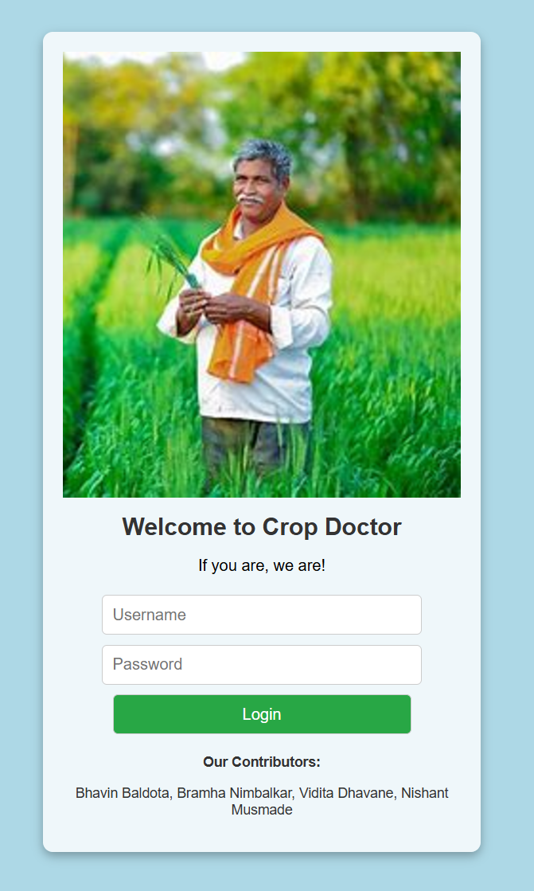
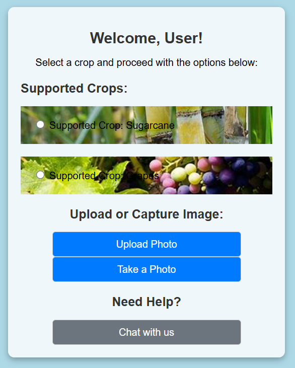
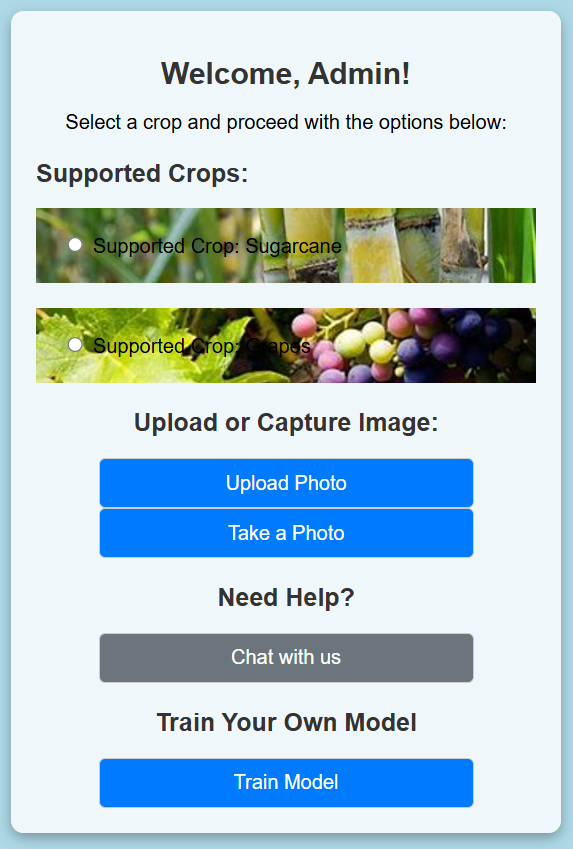
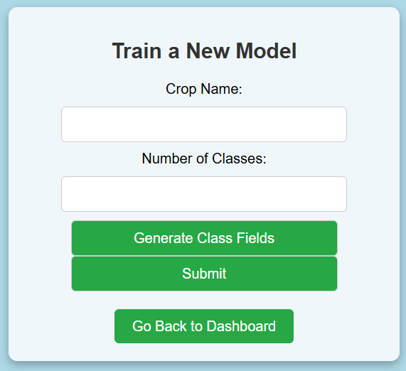
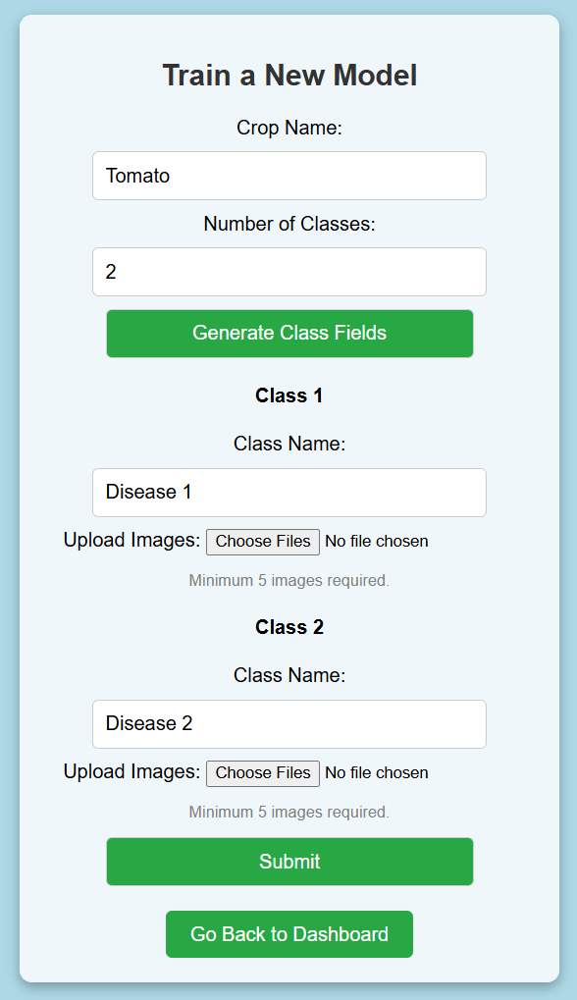
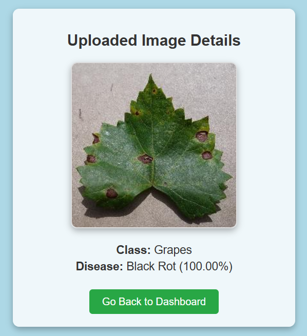
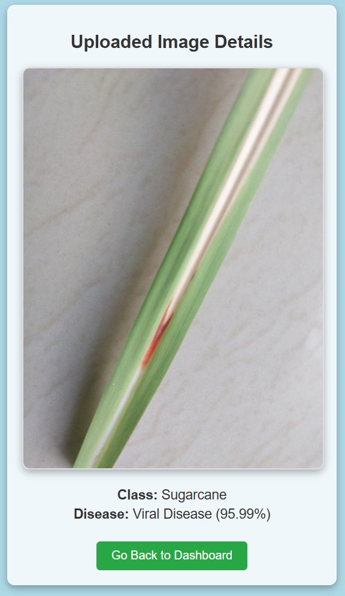
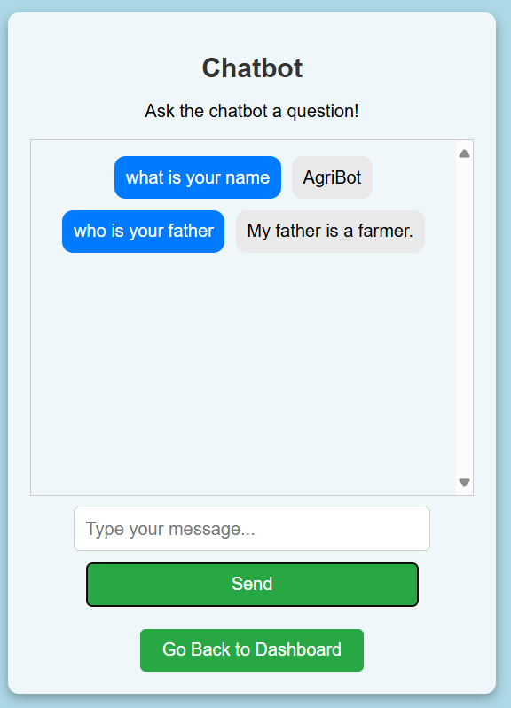

<div align="center">
  <h1 align="center">Crop-Doctor-Final-Year-Project-</h1>
  <p align="center">
    <strong>Crop Disease Detection and Chatbot Application using Deep Learning.</strong>
  </p>
  <p align="center">
    
    
    
  </p>
</div>

---

## 📖 Overview

Welcome to the **Crop-Doctor-Final-Year-Project-** repository. Crop Disease Detection and Chatbot Application using Deep Learning.

### Existing Documentation\n\n# Crop Disease Detection and Chatbot Application

### Overview
This project is a comprehensive Flask-based application designed to help farmers and agricultural enthusiasts identify crop diseases and enhance productivity. It includes an intelligent chatbot, crop disease detection using machine learning models, and an admin portal for adding new models.

---

## Features

### User Portal
1. **Crop Disease Detection**:
   - Supports Sugarcane and Grapes (more can be added).
   - Upload an image to detect crop diseases.
   - Displays results with disease name and confidence score.

2. **Chatbot Integration**:
   - "AgriBot" chatbot powered by transformer models.
   - Helps users with queries related to crops and diseases.

### Admin Portal
1. **Model Training**:
   - Add new crops and train models.
   - Specify crop name, number of classes, and upload images.
   - Automatically organizes images into folders for training.
   - Requires at least 5 images per class.

2. **Dashboard**:
   - Manage and monitor the application.
   - Seamlessly navigate between model training, data upload, and other admin tasks.

---

## Installation

1. **Clone the Repository**:
   ```bash
   git clone https://github.com/username/repo-name.git
   ```
2. **Navigate to the Project Directory**:
   ```bash
   cd repo-name
   ```
3. **Install Dependencies**:
   ```bash
   pip install -r requirements.txt
   ```
4. **Run the Application**:
   ```bash
   flask run
   ```

---

## Usage

### For Users:
1. Select a crop and upload an image for disease detection.
2. Chat with AgriBot for queries.
3. View results with disease prediction and confidence.

### For Admins:
1. Access the admin dashboard.
2. Train new models with crop-specific data.
3. Upload images for training with a minimum of 5 per class.

---

## Directory Structure
```
project/
├── static/
│   ├── images/
│   ├── css/
├── templates/
│   ├── user_dashboard.html
│   ├── admin_dashboard.html
│   ├── train_model.html
│   ├── chatbot.html
├── models/
│   ├── sugarcane_model.keras
│   ├── grapes_model.karas 
|   ├── chatbot_model/
├── uploads/
│   ├── CropName/
│       ├── Class1/
│       ├── Class2/
```

---

## Screenshots
1. **Login Dashboard**
   - To lognin as User use username and password as: user
   - To lognin as Admin use username and password as: admin

   

2. **User Dashboard**:
   - Upload crop image.
   - Chatbot integration.

   

3. **Admin Dashboard**:
   - Train a new model.

   

4. **Train Model**:
   - Crop and class selection with image upload.

       

5. **Disease Detection Results**:
   - Shows the detected disease with confidence.

       

6. **Chatbot**:
   - Interaction with AgriBot.

   

---

## Future Enhancements

1. Expand support for more crops.
2. Implement advanced visualizations for disease analysis.
3. Enhance chatbot capabilities with retrieval-augmented generation (RAG).

---

## Contributors
- **Bhavin Baldota**  
  [LinkedIn Profile](https://www.linkedin.com/in/bhavin-baldota-103553234/) 
  [YouTube Channel](https://www.youtube.com/@YourFatherAI)

- **Bramha Nimbalkar**  
  [LinkedIn Profile](https://www.linkedin.com/in/bramha-nimbalkar-60254b284/) 

- **Nishant Musmade**  
  [LinkedIn Profile](https://www.linkedin.com/in/nishant-musmade-8819a3269/) 

- **Vidita Dhavane**  
  [LinkedIn Profile](https://www.linkedin.com/in/vidita-dhavane-46bbb3235/) 

---

## License
This project is licensed under the MIT License. See the `LICENSE` file for details.\n

---

## 🚀 Getting Started

### Prerequisites

Make sure you have the necessary environment setup to run or build the project. Depending on the repository's technology stack, you may need:
- Standard language compilers/interpreters (e.g., Python, C++, Java).
- Required frameworks and libraries as per the codebase.

### Installation & Usage

1. Clone the repository:
   ```bash
   git clone https://github.com/CoderFatherBB/Crop-Doctor-Final-Year-Project-.git
   ```
2. Navigate to the project directory:
   ```bash
   cd Crop-Doctor-Final-Year-Project-
   ```
3. Run or execute the relevant files as per the language standards.

---

## 🤝 Contributing

Contributions, issues, and feature requests are welcome! Feel free to check the [issues page](https://github.com/CoderFatherBB/Crop-Doctor-Final-Year-Project-/issues).

---

## 👤 Author

**Bhavin Baldota**

- LinkedIn: [Bhavin Baldota](https://www.linkedin.com/in/bhavin-baldota-103553234/)
- GitHub: [@CoderFatherBB](https://github.com/CoderFatherBB)

---
<div align="center">
  <sub>Made with ❤️ by Bhavin Baldota</sub>
</div>
